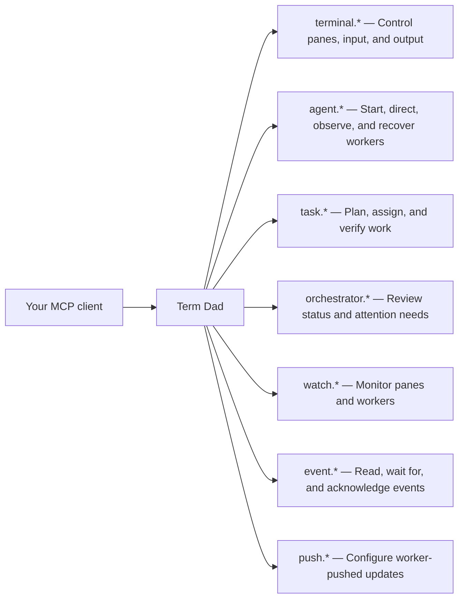

# Term Dad

Term Dad is the “_Dad_” of your terminal: an MCP server that lets your AI assistant
open, close, control, and monitor panes in WezTerm. Use it to coordinate Claude,
Codex, and Copilot sessions across tabs, keep work moving, and supervise everything
from one place.

<div align="center">
  <video src="https://github.com/user-attachments/assets/73713c38-565d-4fb6-93b0-2742b80ccef4" width="800" controls></video>
</div>

## Features

- **Visible workers:** see what each worker is doing and step in when needed.
- **Terminal control:** open tabs and splits, send input, and read output.
- **Persistent tasks:** track assignments, dependencies, results, and verification.
- **Progress monitoring:** watch for updates, finished turns, and requests for input.
- **Worker recovery:** retain worker records across client restarts.
- **Optional screenshots:** inspect the WezTerm window alongside text output.

## Install and setup

You need **Node.js 22+**, a **running WezTerm GUI**, and an **MCP-compatible client**.
To launch Claude Code or Codex workers, install and authenticate their CLIs too.

Clone and build:

```sh
git clone https://github.com/ZakYeo/TermDad.git
cd TermDad
npm ci
npm run build
```

From the repository directory, register Term Dad with your client:

**Codex**

```sh
codex mcp add term-dad -- "$PWD/scripts/launch-local"
```

**Claude Code**

```sh
claude mcp add --scope user term-dad -- "$PWD/scripts/launch-local"
```

Restart your client, then ask:

> Activate Term Dad and list your capabilities as Term Dad.

Or ask:

> Use Term Dad to list my terminal panes, start a shell worker in a new tab,
> run `pwd`, and show its output.

Or ask:

> Activate TermDad and launch one Claude tab and one Codex tab. Start them both
> in plan mode and ask them to review the current codebase. Monitor their plans
> and accept them once they are ready.

For other clients, use `node` with the absolute path to `dist/index.js` as the
stdio server command. These setup commands assume a POSIX shell, including WSL.

See the [setup and operations guide](docs/guide.md) for bundled skills, WSL setup,
multiple GUIs, screenshots, troubleshooting, and development guidance.
Term Dad runs commands as your user; connect only trusted clients and review
worker permission requests normally.

## MCP capabilities



See the [MCP tool reference](docs/tools.md) for individual tools and examples,
and the [architecture](docs/architecture.md) for how they work.

## Licensing

MIT, as declared in [package.json](package.json).
