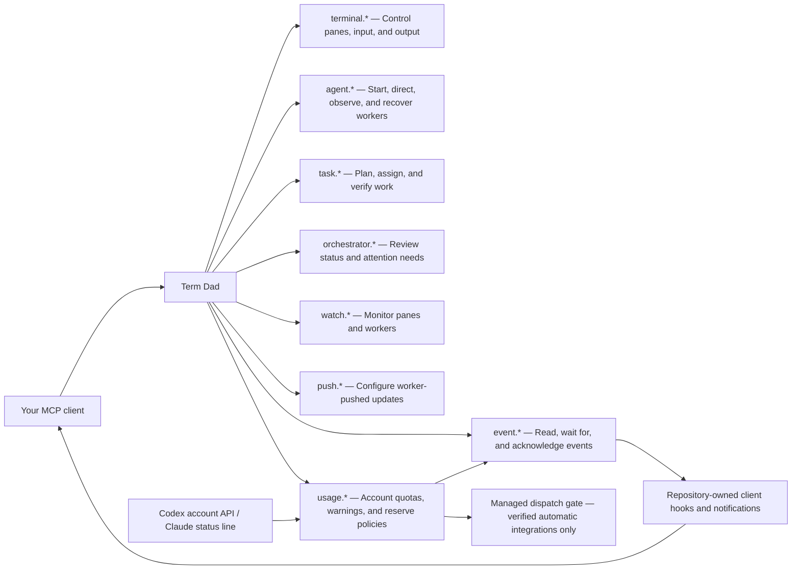

# Term Dad

Term Dad is the “_Dad_” of your terminal: an MCP server that lets your AI assistant
open, close, control, and monitor panes in WezTerm. Use it to coordinate Claude,
Codex, and Copilot sessions across tabs, keep work moving, and supervise everything
from one place.

<div align="center">
  <video src="https://github.com/user-attachments/assets/73713c38-565d-4fb6-93b0-2742b80ccef4" width="800" controls></video>
</div>

## Features

- **Visible workers:** see what each worker is doing and step in when needed.
- **Terminal control:** open tabs and splits, send input, and read output.
- **Persistent tasks:** track assignments, dependencies, results, and verification.
- **Progress monitoring:** watch for updates, finished turns, and requests for input.
- **Worker recovery:** retain worker records across client restarts.
- **Usage awareness:** monitor account allowances, receive threshold warnings, and
  install repository-owned client hooks. Automatic pause/resume is capability-gated.
- **Optional screenshots:** inspect the WezTerm window alongside text output.

## Install and setup

You need **Node.js 22+**, a **running WezTerm GUI**, and an **MCP-compatible client**.
To launch Claude Code or Codex workers, install and authenticate their CLIs too.

Clone and build:

```sh
git clone https://github.com/ZakYeo/TermDad.git
cd TermDad
npm ci
npm run build
```

From the repository directory, register Term Dad with your client:

**Codex**

```sh
codex mcp add term-dad -- "$PWD/scripts/launch-local"
```

**Claude Code**

```sh
claude mcp add --scope user term-dad -- "$PWD/scripts/launch-local"
```

Restart your client, then ask:

> Activate Term Dad and list your capabilities as Term Dad.

Or ask:

> Use Term Dad to list my terminal panes, start a shell worker in a new tab,
> run `pwd`, and show its output.

Or ask:

> Activate TermDad and launch one Claude tab and one Codex tab. Start them both
> in plan mode and ask them to review the current codebase. Monitor their plans
> and accept them once they are ready.

For other clients, use `node` with the absolute path to `dist/index.js` as the
stdio server command. These setup commands assume a POSIX shell, including WSL.

See the [setup and operations guide](docs/guide.md) for bundled skills, WSL setup,
multiple GUIs, screenshots, troubleshooting, and development guidance.
Term Dad runs commands as your user; connect only trusted clients and review
worker permission requests normally.

## MCP capabilities



See the [MCP tool reference](docs/tools.md) for individual tools and examples,
and the [architecture](docs/architecture.md) for how they work.

## Usage monitoring and hooks

Configure an account through MCP, for example:

```js
usage.configure({ accountRef: "codex-personal", provider: "codex" })
usage.refresh({ accountRef: "codex-personal" })
usage.status({ accountRef: "codex-personal" })
```

Warnings default to **80%, 90%, and 95% used**. The reserve policy keeps **5%**
of the five-hour and weekly allowances. The policy engine can park work at a
safe boundary and permit continuation after fresh short-window **and** weekly
checks; a reset timestamp alone never establishes recovery.

**Current support:** Codex has a read-only account collector; Claude has a passive
status-line collector; Copilot account quotas are reported as unavailable.
All built-in clients currently run in **advisory mode**. Automatic mode is rejected
until collection, account identity, pause, and idle wake are verified together.
This release does not promise unattended overnight pause/resume.

Build first, configure the account, then preview and install its supervisor hooks:

```sh
npm run build
node dist/index.js hooks preview --client codex --account codex-personal
node dist/index.js hooks install --client codex --account codex-personal
node dist/index.js hooks doctor --client codex
```

Use `--client claude` for Claude and configure a matching `provider: "claude"`
account first. The installer preserves existing hooks and wraps an existing
Claude status line. Copilot uses a project-local `.github/hooks/term-dad.json` by
default. Restart the client and review its hook trust prompts; building does not
install anything into personal configuration.

Run the same `install` command after moving the checkout. To remove only the
installer-owned entries, use `node dist/index.js hooks uninstall --client codex`.
For alternate profiles/configuration paths, pass `--config` and the same
`--state-dir` used by the MCP server.

See [usage policies and support](docs/usage.md) and the
[complete hook inventory and installation guide](docs/hooks.md), including the
existing lifecycle push and desktop-notification hooks. All hook implementations
and client templates live in this repository; local configuration only refers to
the built helpers.

## Licensing

MIT, as declared in [package.json](package.json).
