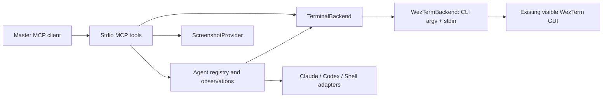

# Architecture and observation design decision

Status: accepted for the proof of concept.

## Why text first

We need stable pane identities, inexpensive incremental observations, and reliable input into interactive applications. WezTerm already exposes pane IDs and terminal text through its CLI. Pixels cost more context and are harder to diff, and visual inactivity does not establish completion. Therefore metadata and text are primary; screenshots are requested only when visual context helps resolve ambiguity. Consequence: state classifiers are intentionally heuristic and expose UNKNOWN rather than declaring silent tasks finished.

## Backend

`TerminalBackend` isolates the terminal implementation. `WezTermBackend` invokes the installed CLI with argument arrays and `--no-auto-start`, avoiding hidden GUI creation. The [WezTerm CLI reference](https://wezterm.org/cli/cli/index.html) defines the operations. IDs and commands are validated; no shell joins argv. Spawn commands belong to the selected terminal domain. The optional `scripts/launch-local` resolves local Claude/Codex executables from PATH and passes JSON argv overrides; npm Codex is launched with the same Node executable as the MCP host. Remote domains require explicitly supplied target-domain commands. Text goes through stdin with bracketed paste handling, while keys use `send-text --no-paste`. Submit separates paste and Enter by 100ms to allow TUI paste processing.

Windows WezTerm can be controlled from WSL using its `.exe`; it spawns Linux programs when the parent pane is in a WSL domain. The server environment must permit Windows interoperability. This was exercised against the installed 2024 CLI. Get-text uses negative starting lines for scrollback, then bounds the final tail. List preserves additional WezTerm JSON properties.

## Adapters and activity

`InteractiveAgentAdapter` has a client name and text classifier. ClaudeCodeAdapter and CodexAdapter recognize permission/question screens, errors, work indicators and prompt markers. ShellAdapter recognizes common shell prompt endings. These are patterns, not authenticated application state. An injected `command` must actually match the selected adapter.

Observation first checks pane existence and metadata, reads the recent tail, hashes it with SHA-256, updates output timestamps on change, and classifies text. Silence does not cause an IDLE transition. Permission/question patterns take precedence over prompt markers. After input, a short timing guard and comparison with the pre-input output hash prevent an unchanged old prompt from becoming ready merely because time passes. RUNNING_EXTERNAL_COMMAND and IDLE are reserved states; the current CLI/text evidence does not reliably distinguish them. Process information is passed through only when WezTerm supplies it.

Observations return IDs, status, activity, timestamps, output hash, cwd, process, input flags, and recent text. With `since`, identical output is omitted; prefix additions use append; screen rewrites use replace. Expired/unknown observation IDs return a full replacement with `deltaReset`. Each worker retains at most 16 observations of 24,000 characters; the registry is capped at 64. Polling is on demand, not a background loop. Missing panes remove registry entries; transport failures preserve them. Waits are bounded, return diagnostic last state, and never approve a prompt.

## Screenshots

`ScreenshotProvider` returns a PNG MCP image. `CommandScreenshotProvider` invokes a configured trusted executable with one pane ID argument; stdout must contain base64 PNG. It enforces a signature and 5 MiB bound. No polling captures screenshots.

The bundled PowerShell provider matches the current mux window title against WezTerm GUI process window titles and captures the matching HWND with PrintWindow. A leading braille activity spinner is ignored. Ambiguous or changing titles produce an error instead of capturing an unrelated window. Captures include the whole terminal window, including other visible panes, activate the requested pane first, and restore a minimized window. The WSL wrapper uses a process-local execution policy override to run this repository's script; it does not change the machine policy. GPU capture may vary by driver, so inspect results on a new machine. Linux/macOS providers can implement the same executable contract.

## Lifecycle and failures

MCP stdio stdout contains only protocol messages. Tool failures return `isError` and diagnostics; logs go to stderr without intentionally logging terminal content. CLI calls have a 15-second subprocess timeout and 8 MiB output limit. Worker waits allow up to 120 seconds plus the duration of the final observation. A failed initial prompt wait retains the worker for diagnosis. Closing the MCP connection does not kill workers. Multiple server instances have independent registries but see the same terminal panes.

## Durable event journal

`events.ts` exports `EventQueue`, `FileEventStorage`, the event input contract, and
an injectable `EventStorage` transaction boundary. `event-tools.ts` exports
`registerEventTools`; `createServer` accepts an optional queue as its third
argument and returns it as `events`. This standalone feature accepts injected
publishing but is not yet wired to WatchManager. Future wiring should pass
`async input => { await events.publish(input); }` as the async sink and preserve
producer retry on rejection. No arbitrary event injection is exposed over MCP.

The queue persists only bounded metadata and queue-owned identity/acknowledgment
fields. Producers must construct summaries from static metadata, never excerpts
from terminal content, prompts, credentials, or exception messages. Journal
validation rejects unknown fields, malformed records, duplicate IDs, inconsistent
sequences and files over 4 MB. Corruption raises `EVENT_STATE_CORRUPT`; it never
resets the journal or silently discards pending records. Keep the damaged file
for explicit recovery from a verified copy; do not delete it to bypass an error.

Every file transaction takes an exclusive `events.lock` using atomic creation.
This serializes local processes sharing the state directory; short contention
retries are bounded. Each transaction rereads the journal, so other instances'
publications and acknowledgments are visible. Waits register before reading and
check pending events on local publication and every 100ms while waiting, avoiding
lost notifications and observing other instances. Filters combine with AND;
values within each filter combine with OR. Waiting does not reserve events.
Request cancellation, deadlines and queue close settle waits even during a pending
read. Queue close drains already accepted storage operations and rejects new work;
it never closes terminal panes. The in-memory operation backlog is capped at 128.

A mutation writes a unique 0600 temporary file, syncs it, atomically renames it to
`events.json`, then syncs the private containing directory. The rename is the
commit point. Failures before it reject publication and leave the old journal
intact. Directory sync or lock cleanup failure after commit is exposed through
`storageWarning` on subsequent lists, without rejecting an already committed
publication and provoking a duplicate producer retry. A directory-sync warning
means power-loss durability is uncertain. Warnings last for the storage instance's
lifetime. A process death immediately after commit may still leave the producer
unsure whether publication completed; this API does not promise exactly-once
production across that crash window.

A crash during a transaction can leave `events.lock` or an orphan `events.*.tmp`.
Locks are deliberately not stolen on a timer: a slow live writer must never lose
exclusivity. Stop **all** servers using that directory, preserve `events.json`,
then remove the stale lock and orphan temporary files before restarting. Pending
committed events then replay normally. Do not remove a lock while another server
may be using it. This implementation targets private local POSIX filesystems;
network filesystems and hostile same-user filesystem modification are outside its
locking/security model. Existing unsafe directory or journal permissions are
rejected. No background journal is created merely by starting the MCP server.

Only acknowledged events are evicted for space; full pending capacity rejects
publication explicitly. Acknowledgment is idempotent while a record is retained;
expired/unknown IDs are returned separately. Stable sequence counters survive
compaction, and overflow fails rather than wrapping. Waiters, list output, event
fields, journal size, operation backlog and timeouts all have fixed bounds.
