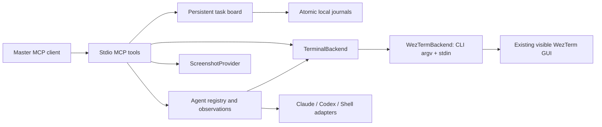

# Architecture and observation design decision

Status: accepted for the proof of concept.

## Why text first

We need stable pane identities, inexpensive incremental observations, and reliable input into interactive applications. WezTerm already exposes pane IDs and terminal text through its CLI. Pixels cost more context and are harder to diff, and visual inactivity does not establish completion. Therefore metadata and text are primary; screenshots are requested only when visual context helps resolve ambiguity. Consequence: state classifiers are intentionally heuristic and expose UNKNOWN rather than declaring silent tasks finished.

## Backend

`TerminalBackend` isolates the terminal implementation. `WezTermBackend` invokes the installed CLI with argument arrays and `--no-auto-start`, avoiding hidden GUI creation. The [WezTerm CLI reference](https://wezterm.org/cli/cli/index.html) defines the operations. IDs and commands are validated; no shell joins argv. Spawn commands belong to the selected terminal domain. The optional `scripts/launch-local` resolves local Claude/Codex executables from PATH and passes JSON argv overrides; npm Codex is launched with the same Node executable as the MCP host. Remote domains require explicitly supplied target-domain commands. Text goes through stdin with bracketed paste handling, while keys use `send-text --no-paste`. Submit separates paste and Enter by 100ms to allow TUI paste processing.

For automatically resolved local Claude commands, the launcher passes the host
PATH through an `env` argv entry. GUI-created WSL panes otherwise omit paths such
as Bun's installation directory and can break Claude hooks. Explicit command
overrides remain unchanged; remote domains still require target-domain commands.

Windows WezTerm can be controlled from WSL using its `.exe`; it spawns Linux programs when the parent pane is in a WSL domain. The server environment must permit Windows interoperability. This was exercised against the installed 2024 CLI. Get-text uses negative starting lines for scrollback, then bounds the final tail. List preserves additional WezTerm JSON properties.

## Adapters and activity

`InteractiveAgentAdapter` has a client name and text classifier. ClaudeCodeAdapter and CodexAdapter recognize permission/question screens, errors, work indicators and prompt markers. ShellAdapter recognizes common shell prompt endings. These are patterns, not authenticated application state. An injected `command` must actually match the selected adapter.

Observation first checks pane existence and metadata, reads the recent tail, normalizes it (per-line trailing whitespace stripped, blank runs collapsed to one), hashes the normalized text with SHA-256, updates output timestamps on change, and classifies text. Silence does not cause an IDLE transition. Permission/question patterns take precedence over prompt markers. After input, a short timing guard and comparison with the pre-input output hash prevent an unchanged old prompt from becoming ready merely because time passes. RUNNING_EXTERNAL_COMMAND and IDLE are reserved states; the current CLI/text evidence does not reliably distinguish them. Process information is passed through only when WezTerm supplies it.

Observations return IDs, status, activity, timestamps, output hash, cwd, process, input flags, and the last 20 lines of normalized text (`lines` raises the cap to 150; `linesOmitted` reports the rest). With `since`, identical output is omitted; a grown current line or a scrolled screen whose head matches the previous tail uses append with only the new part; screen rewrites use replace. `wait_for_outcome` pins the `since` text before polling so its final delta survives history eviction. `orchestrator.status` returns the same observations without text. Reads retry through a bounded back-off when a worker or journal lock is held; writes fail fast. Expired/unknown observation IDs return a full replacement with `deltaReset`. Each worker retains at most 16 observations of 24,000 characters (board polls through `orchestrator.status` do not record one, so they cannot evict a `since` baseline); the registry is capped at 64. Agent observations are on demand; explicitly created watches also poll through the same guarded observation path. Missing panes remove registry entries; transport failures preserve them. Waits are bounded, return diagnostic last state, and never approve a prompt.

## Screenshots

`ScreenshotProvider` returns a PNG MCP image. `CommandScreenshotProvider` invokes a configured trusted executable with one pane ID argument; stdout must contain base64 PNG. It enforces a signature and 5 MiB bound. No polling captures screenshots.

The bundled PowerShell provider restricts candidates to the configured GUI socket PID when present, enumerates that process's visible native windows, and captures the uniquely matching HWND with PrintWindow. It considers both the mux window title and active pane title because the mux title can be empty or stale after tab activation. Default tab-count prefixes and a leading braille activity spinner are ignored. Multiple matching windows produce an error; custom title formats can still prevent matching. Captures include the whole terminal window, including other visible panes, activate the requested pane first, and restore a minimized window. The WSL wrapper uses a process-local execution policy override to run this repository's script; it does not change the machine policy. GPU capture may vary by driver, so inspect results on a new machine. Linux/macOS providers can implement the same executable contract.

## Lifecycle and failures

Managed Codex workers receive an explicit `$term-dad-worker` invocation and the
bundled skill body with their first submitted task. The same skill source ships
in `skills/` for local installation; embedding it avoids server-host paths in
remote domains. No prompt means initialization is deferred until `agent.send`
(also used by broadcasts). Successful submission marks initialization complete;
follow-ups remain literal. Concurrent inputs to one worker are rejected to avoid
interleaved pastes and duplicate initialization. Failed submission records uncertain delivery, since a transport failure after
paste/Enter may have delivered some input. Inspect and explicitly reattach before
retrying, declaring whether the skill was initialized. This is delivery of role
instructions, not proof the model followed them. Raw terminal operations do not
initialize skills, and Claude/shell inputs are unchanged.

MCP stdio stdout contains only protocol messages. Tool failures return `isError` and diagnostics; logs go to stderr without intentionally logging terminal content. CLI calls have a 15-second subprocess timeout and 8 MiB output limit. Worker waits allow up to 120 seconds plus the duration of the final observation. A failed initial prompt wait retains the worker for diagnosis. Closing the MCP connection does not kill workers. Multiple server instances sharing a state directory share durable worker metadata and input exclusion, while observation caches remain process-local.

## Durable event journal

`events.ts` exports `EventQueue`, `FileEventStorage`, the event input contract, and
an injectable `EventStorage` transaction boundary. `event-tools.ts` exports
`registerEventTools`. `createServer(backend?, screenshots?, watchOptions?, eventQueue?, workerStorage?, taskStorage?)`
returns both `watches` and `events`; passing an `EventQueue` as the third argument
remains supported. By default WatchManager publishes through the durable queue.
An explicitly injected `WatchOptions.sink` replaces that default for embedders.
Queue rejection leaves watch delivery pending and observable for later retry.
Event tool registration precedes watch registration so MCP disconnect disposes
watchers and awaits their in-flight sink before closing the queue and settling
event waits. No arbitrary event injection is exposed over MCP.

The queue persists only bounded metadata and queue-owned identity/acknowledgment
fields. Producers must construct summaries from static metadata, never excerpts
from terminal content, prompts, credentials, or exception messages. Journal
validation rejects unknown fields, malformed records, duplicate IDs, inconsistent
sequences and files over 4 MB. Corruption raises `EVENT_STATE_CORRUPT`; it never
resets the journal or silently discards pending records. Keep the damaged file
for explicit recovery from a verified copy; do not delete it to bypass an error.

Every file transaction takes an exclusive `events.lock` using atomic creation.
This serializes local processes sharing the state directory; short contention
retries are bounded. Each transaction rereads the journal, so other instances'
publications and acknowledgments are visible. Waits register before reading and
check pending events on local publication and every 100ms while waiting, avoiding
lost notifications and observing other instances. Filters combine with AND;
values within each filter combine with OR, and now include an `occurredAt` window
(`notBefore`, `maxAgeMs`). Waiting does not reserve events.

The MCP wait is fresh by default while the library primitive still replays: a
fresh wait registers, then reads the journal's current sequence as an exclusive
baseline. Freshness is deliberately a sequence and not a clock reading, because
`occurredAt` records when a pane was sampled while publication can lag it by a
watch's cooldown; a timestamp cutoff would let a wait time out while its event sat
pending. Registering before reading the baseline can only over-include one event,
never lose one.
Request cancellation, deadlines and queue close settle waits even during a pending
read. Queue close drains already accepted storage operations and rejects new work;
it never closes terminal panes. The in-memory operation backlog is capped at 128.

A mutation writes a unique 0600 temporary file, syncs it, atomically renames it to
`events.json`, then syncs the private containing directory. The rename is the
commit point. Failures before it reject publication and leave the old journal
intact. Directory sync or lock cleanup failure after commit is exposed through
`storageWarning` on subsequent lists, without rejecting an already committed
publication and provoking a duplicate producer retry. A directory-sync warning
means power-loss durability is uncertain. Warnings last for the storage instance's
lifetime. A process death immediately after commit may still leave the producer
unsure whether publication completed; this API does not promise exactly-once
production across that crash window.

A crash during a transaction can leave `events.lock` or an orphan `events.*.tmp`.
Every lock records its holder's pid; a lock whose pid could not be written is
released and the acquisition fails, so no live holder ever sits behind a pid-less
lock. On the next acquisition, and in a sweep at server startup, a lock whose
holder has exited is reclaimed and temporaries older than a minute are removed.
Reclaims are serialised through a short-lived `reclaim.lock` and re-check the
target under it, so two processes that both judged the same dead lock stale cannot
remove each other's fresh replacement; a pid-less lock from an older build counts as abandoned
once it is older than the five-second write window. Locks are still never stolen
on a timer from a live holder: a slow live writer never loses exclusivity, and a
persistent `*_STORAGE_BUSY` means a live process holds the lock. Pending committed
events replay normally after a reclaim. This implementation targets private local POSIX filesystems;
network filesystems and hostile same-user filesystem modification are outside its
locking/security model. Existing unsafe directory or journal permissions are
rejected. No background journal is created merely by starting the MCP server.

Only acknowledged events are evicted for space; full pending capacity rejects
publication explicitly. Ageing `ready` and `inactive` records acknowledge
themselves after a bounded window so an undrained journal does not reach that
limit; the expirable set is closed and default-deny, so `attention_required`, `input_required`,
`pane_disappeared`, `session_ended` and unknown kinds are never swept. The sweep decides in a read-only pass and escalates to a write only
when something has actually aged, so a quiet server still creates no journal. It
runs inside publication and on an unref'ed bounded timer, never on a read, and
never from an external reader. No journal field records the reason: the state
schema is strict, so adding one would make a newer journal unreadable by an older
server and stop it publishing — provenance stays derivable from the closed kind
set and the record's age. Acknowledgment is idempotent while a record is retained;
expired/unknown IDs are returned separately. Stable sequence counters survive
compaction, and overflow fails rather than wrapping. Waiters, list output, event
fields, journal size, operation backlog and timeouts all have fixed bounds.

## Supervisor wake-up

`src/wait-cli.ts` adds a `wait-for-event` subcommand to the existing binary, and
`src/index.ts` dispatches to it through a dynamic import so a CLI run never loads
the server's module graph — that graph reads the bundled worker skill at import
time and constructs a push socket. The subcommand is not an MCP tool and registers
none; the tool count is unchanged.

It exists because no MCP mechanism re-invokes an idle client session. A detached
process that blocks on the journal and exits when a matching event lands turns
*process exit* into the wake, carrying the event metadata with it. `event.wake_command`
(`src/event-tools.ts`) reports the exact argv from the server's own location and
runtime, with `--state-dir` and `--until-event` filled in, because the two wrong
invocations tried in the field — bare `term-dad` and `dist/wait-cli.js` — fail
silently or with exit 127. `--until-event` keeps waiting through what would have
been timeouts, bounded only by a fixed 24-hour cap. Whether a given
client resumes a session on that exit is the client's property, not this server's.
Claude Code does, and the supervisor skill now states that plainly and forbids
ending a turn with a busy worker and no pending waiter.

The waiter reads `events.json` directly and **never takes `events.lock`**, unlike
every in-process reader. Correctness comes from the commit protocol rather than
the lock: a mutation renames a complete file, so an unlocked reader observes
either the whole previous version or the whole next one, never a torn one. The
reason is containment — the waiter is long-lived, detached and killable, and
`FileJournal` deliberately never steals a lock on a timer, so a waiter killed
mid-transaction would leave `events.lock` behind and fail every later
`events.publish`, including the push ingress sink. It also cannot contend with a
publisher. It validates with the same state schema, enforces the same owner-only
and size bounds, treats an absent journal as "nothing yet", and retries a read
that fails mid-rename; a journal that stays invalid for the whole timeout is
reported as a storage failure rather than as a timeout.

Freshness uses the same sequence baseline as the MCP wait. A waiter that arms
before any journal exists baselines at zero, so the first event ever published
still wakes it. It acknowledges nothing, writes nothing, and holds no terminal.

## Worker-pushed events

`src/ingress.ts` exports `PushIngress` (authentication and the event contract),
`PushSocket` (transport) and `pushSocketPath`. `src/push-workers.ts` exports
`WorkerPushRegistry`, the `WorkerPush` surface `Agents` depends on, so worker code
never sees the transport. `src/worker-hooks.ts` builds the launch arguments and
`src/term-dad-notify.ts` is the executable a worker hook runs.

Delivery is opt-in per pane and starts disabled. `agent.spawn` mints a token,
injects `--settings` hooks for a Claude worker or a `-c notify=` program for a
Codex worker, and binds the registration to the pane once the spawn returns; a
shell worker is launched unmodified. Hooks therefore exist from launch but stay
inert, so `push.set` needs no relaunch. A push against a disabled registration is
answered `{ok:true,delivered:false}` and records nothing.

Transport is a Unix socket per server process (`push.<pid>.sock`, mode 0600) in
the state directory, so servers under different MCP clients never contend; there
is no network listener. Listening is best effort: a server that cannot bind still
polls. `listen` sweeps `push.<pid>.sock` files that no longer answer, replaces a
stale socket at its own path, and refuses to replace a non-socket file. The server
handle is unref'ed, so the ingress never keeps a process alive; the transport owns
that lifetime. The stdio transport itself only reads stdin data, so `src/index.ts`
ends the process explicitly: when stdin ends, and when the parent pid changes while
something else still holds the stdin pipe open (checked every five seconds,
`TERM_DAD_PARENT_CHECK_MS` in tests), it runs the close chain with a five-second cap
and exits. A server therefore never outlives the client it was launched for, and
peers with a live client are never touched. Connections are half-open so a reply survives a slow sink, and are
bounded at 64 concurrent, 4,096 bytes per request and a 5-second idle timeout.

Requests carry only `{token,kind}`. Tokens are 256-bit and per worker, held in
memory *and* in that worker's owner-only credential file under
`push-credentials/`, and released with the worker. The hook argv carries only that
file's path: a running process's argv cannot be rewritten, so interpolating a
socket path and token into it orphaned every surviving worker across a supervisor
restart, and the file can be replaced under a live worker instead. `launch` writes
it before the record is inserted, so the binding is durable from the first write;
a write failure degrades to unmodified argv and no binding rather than failing the
spawn, which is safe only because `push.set` then refuses the pane. The store is
deliberately write-only — it exposes no read method — so "a credential is never
loaded into server or event state" holds by construction. It is not a security
boundary: workers share the server's uid, so 0600 isolates nothing that the
previous argv did not already expose.

Startup and `agent.reattach` re-key surviving workers and revoke their previous
tokens, and both leave delivery disabled, since push is off until enabled and a
restart cannot verify that a worker's hook configuration survived. Restore is
gated on the same verified attachment that guards every other managed operation:
worker metadata is shared by state directory, so an ungated pass would re-key
another live server's workers and silently revoke their tokens. Each worker's
re-key runs under its per-worker lock, so it cannot race a concurrent reattach
into the wrong pane or resurrect a forgotten worker. A worker whose lock was held
at startup is skipped, not lost: `push.set` re-keys an attached survivor on demand
under the same lock before enabling it, and refuses an unattached one with advice
to `agent.reattach`. Push tools resolve the worker by UUID or name through the
same registry lookup as every other worker tool. It is skipped entirely when
the socket did not bind, because rewriting credentials to a dead path would also
strand a peer's worker. Credentials are swept by membership of the durable journal
rather than by liveness probe — a credential cannot be probed the way a socket can
— and never when that journal could not be read. Two servers attached to the same
verified GUI still race a re-key, last writer wins, and the loser reports
`enabled:false` and never becomes `proven`; that is observable rather than
arbitrated. Pushed kinds are limited to `input_required`, `ready`
and `session_ended` (`attention_required` is only ever derived from a pane sample); summaries are authored by the server, so a worker cannot
inject event text, and the metadata bound is the same one watches obey. Unknown
or revoked tokens yield `PUSH_UNAUTHORIZED`; a failed sink yields
`PUSH_DELIVERY_FAILED` without leaking its cause. `MCP` still exposes no arbitrary
event injection: `push.status` and `push.set` only toggle authenticated local
delivery.

Push reports independent facts rather than one flag, because the previous success
value described worker-side wiring intent and was read as deliverability.
`enabled` is intent; `registered` is a live token in this process; `hookSurface`
is whether this server launched the pane with hooks at all; `deliveries` counts
only pushes the sink accepted; `proven` is an observed hook and is the sole
evidence the channel works; `deliverable` is the conjunction of everything the
server can see. Nothing inspectable establishes that a worker's CLI accepted its
injected configuration, that the notifier is executable there, or that the
worker's process can reach the socket, so `deliverable` deliberately stops short
of a promise. Enabling a channel that cannot deliver fails explicitly
(`PUSH_NOT_WIRED`, `PUSH_SOCKET_UNAVAILABLE`, `PUSH_UNSUPPORTED_WORKER`) rather
than succeeding; disabling always succeeds, since the safe direction must not be
blocked by the reasons a channel is broken. The bind outcome is carried into the
registry instead of being logged and discarded, so no surface can report an
intended socket path as a bound one.

An accepted push publishes the event and then calls `WatchManager.confirm`, which
samples the pane through the same guarded path as polling, so the recorded status
is the terminal's, not the worker's claim. Watches derive their due time from the
last poll and select `pushPollMs` over `pollMs` only while the worker's push is
*deliverable* — registered, enabled, and backed by a socket this process actually
bound — so enabling or disabling push takes effect on the next pass rather than
after an already-scheduled interval elapses. Deliberately not mere intent: an
enabled registration on a server that failed to bind would otherwise leave the
pane neither pushed nor polled at its normal rate.

## Background watches and desktop delivery

`WatchManager` in `src/watches.ts` owns up to 64 explicit watches. It takes injected
`TerminalBackend`, `Agents`, optional async event sink, notification provider, and
clock. A single unref'ed recursive timer drives serial non-overlapping passes;
`automatic:false` plus `poll()` supports deterministic schedulers. Backend calls
remain bounded by the transport. Injected sinks/providers must settle in bounded
time; they are awaited serially and must not call back into `poll()`/`dispose()`.

Managed watches call `Agents.observe`, preserving permission precedence and the
post-input stale-prompt guard. Unmanaged watches require an explicit adapter and
retain only a hash of the bounded 24,000-character text tail. Baseline suppresses
ready but surfaces input-required screens. Only successful listings establish
pane disappearance. Transitions deduplicate; inactivity resets on changed text.

Events contain only `{kind,paneId,watchId?,agentId?,occurredAt,summary}`, where
`occurredAt` is ISO and summaries are fixed strings. No titles, terminal output,
paths, secrets, raw backend errors, IDs for the queue, or acknowledgment metadata
are generated. The server supplies the queue as the default async sink; standalone
`WatchManager` instances still allow an optional sink and desktop delivery. Five pending
kinds per watch coalesce repeated undelivered transitions. `attention_required` is the
exception on both counts: it is keyed on `status` and output hash rather than the
interaction request (which no longer exists at a ready prompt), a new key replaces a
pending request rather than being dropped, and delivery drains it first and outside the
cooldown. Successful destinations
are tracked independently so one failed destination does not repeat another.

`registerWatchTools` isolates schemas and registration from `server.ts`, returns
an async disposer, and chains shutdown after awaiting disposal. The server chains
this with queue close; embedders can explicitly `await watches.dispose()` before
closing their queue. Disposal clears
timers and registrations immediately, waits for in-flight polls/creation, and
suppresses further delivery after an awaited operation returns. An external
notification or sink operation already in flight cannot be retracted. Nothing
closes worker panes on watch removal or MCP disconnect.

`CommandNotificationProvider` is opt-in through a JSON argv environment setting;
its bounded subprocess receives metadata JSON via stdin and never writes child
output to MCP stdout. See the tool reference for the Windows/WSL helper setup.

## Persistent worker registry

`worker-storage.ts` defines validated metadata and injectable `WorkerStorage`
transactions/exclusion. `FileWorkerStorage` and `FileEventStorage` share the
atomic `FileJournal` implementation in `journal.ts`, with separate files and
locks. `MemoryWorkerStorage` is explicitly available for tests/embedders; standalone
`Agents` defaults to isolated memory, while `createServer` defaults to file storage
and accepts storage as its fifth argument. Existing event-queue injection remains
compatible. Starting the server does not create a journal.

Durable records contain worker identity, adapter, endpoint/process identity, binding
revision, skill delivery flag, input timestamp/hash/uncertainty, and — when the pane
was launched with injected hooks — the hook surface kind and the absolute path of its
credential file. They contain no token, terminal content, prompts, launch argv, cwd,
or screenshots. That path is stored rather than recomputed because the baked argv is
immutable, so the record is the only account of what the worker actually rereads.
The field is optional, so an older journal still parses; the schema is strict, so an
**older server cannot read a newer journal** — it would reject the whole file as
corrupt, not just that worker. Do not downgrade across this change while workers are
registered without first forgetting them or moving `workers.json` aside. Each managed operation
refreshes metadata before acting; observation caches are keyed by ID and binding
revision. The synchronous `Agents.get` exposes only that instance's existing cache.
Async resolution and managed operations are the source of truth.

Per-worker locks cover observation and input/lifecycle operations. Short journal
transactions enforce shared names, pane uniqueness, and capacity. Spawn reserves
a bounded record before launching without holding the journal lock across the
backend call. A failed mapping commit retains a diagnostic reservation and live
pane. Delivery intent is persisted before paste/Enter or Ctrl+C; only recorded
success clears uncertainty. No cross-crash exactly-once terminal delivery is
claimed. Concurrent operations reject as busy, and all admitted operations drain
on shutdown. Wait loops stop when their next observation sees shutdown.

`TerminalBackend.instance` is optional. The Windows/WSL resolver uses a configured
local GUI socket (or discovers the sole, foreground, or newest live GUI) and verifies
the executable, PID and start time via a read-only PowerShell helper. CLI and
screenshot subprocesses explicitly inherit the selected endpoint. A resolver
pins its first GUI identity and rejects a replacement until explicit selection or MCP restart. Other
backends return null unless an identity provider is injected. Null identity permits
only explicit process-local attachment; it never establishes automatic recovery.

Recovery verifies instance and pane existence. A different or unavailable instance
leaves records detached; missing panes are removed only after a matching-instance
check succeeds. Reattachment preserves logical identity but changes binding revision,
invalidating observation caches and requiring watch recreation. Managed screenshots
and watches use the same attachment checks. Watches remain process-local and
existing durable event records remain independent of worker removal.

See the tool reference for explicit adoption, uncertainty acknowledgment, stale-lock
recovery, and the single-GUI-per-server boundary.

## Persistent task board

`TaskBoard` separates task progress from terminal activity and worker lifecycle.
Strict task records contain goals, priorities, assignment UUIDs, dependency IDs,
blockers and acceptance criteria. Whole-graph validation rejects missing/cross-board
references, cycles and invalid completion. Every mutation after creation compares
an expected revision under the storage transaction, preventing lost updates across
supervisors. Worker disappearance never deletes tasks or infers completion.

`FileTaskStorage` shares `FileJournal` with workers/events but owns `tasks.json` and
`tasks.lock`. Startup is lazy. Corrupt state is preserved, writes are atomic, and
post-commit durability warnings do not turn successful writes into retryable
failures. Task state is bounded to 1,000 records and 4 MB; archived records still
count. Explicit descriptions and evidence are stored content, unlike the event
queue's static metadata; they must never be automatically populated from terminal
output. No task content is logged or used to execute commands.

`createServer` registers task tools with file storage by default, accepts injected
`TaskStorage` as its sixth argument and returns `tasks`. Task operations are capped
at 128 outstanding requests and drained during shutdown. Existing event/watch
shutdown ordering is retained. The standalone library requires explicit storage.

`task-workers.ts` enriches task reads with worker attachment snapshots and worker
views with up to 20 compact task summaries each. Summary failures are explicit and
do not prevent worker recovery. These are separate journal reads; assignments are
not atomic reservations, and missing workers remain referenced for later
reassignment. Worker observations cannot satisfy criteria or set task status.
Task-change event delivery and automatic dispatch are outside this implementation.

## Reported results and verification

Task state version 2 keeps bounded attempts, reports and verification decisions
in the existing atomic task journal. An attempt snapshots requirements and worker
assignment. Only its latest report can be verified; verification references the
same work version and requires explicit evidence for each criterion. Both completion
APIs enforce the same graph and verification invariants. Failed checks prevent a
passing decision. Old done records migrate as legacy completions, without evidence.
Reads migrate in memory; successful writes persist the new format.

Terminal observations cannot write task results. Managed submissions persist a
turn ID and optional task/attempt reference with delivery intent. Assignment is
checked before sending, but separate journals do not create an atomic reservation.
Reports remain supervisor-supplied, with worker-reported or supervisor-recorded
provenance; exact command capture is outside this release. Work-version references
are declarations, not a filesystem monitor or executable commands.

Input request state is observation-local and contains metadata plus a fingerprint,
not durable prompt text. Required input and readiness are separate flags, while
legacy awaitingInput remains compatible. Unknown output retains uncertainty;
sending input does not resolve a request. Turn waits return explicit reasons and
retain permission precedence, the stale-prompt guard, and verified disappearance.
Binding changes, supersession and uncertain delivery cannot yield turn completion.

## Task-focused attention snapshots

`AttentionService` derives `orchestrator.attention` from one `TaskBoard.snapshot`
read and a refreshed `Agents.snapshot`. The former includes the complete graph
and archived records for change detection; the latter preserves existing identity,
permission, input uncertainty, and stale-prompt guards. Observations timestamp
successful acquisition separately from output activity. Projection and comparison
live in separate modules; neither writes task state nor retains terminal text.

Entries may occupy multiple action categories. Eligibility follows `taskView`;
worker readiness and occupancy are advisory dispatch constraints. Only matching
current attempt references permit task-specific ready-without-report signals.
Assignment-only context explicitly carries uncertainty. Terminal activity never
becomes result evidence. Independent source failures yield partial views and
suppress comparisons for the unavailable source, without fabricating removals.

The service retains up to 16 compact snapshots, each expiring 15 minutes after
collection. Fingerprints omit observation IDs and advancing ages but include task
revisions, derived attention, binding/turn references, and output hashes. Frozen
pagination covers both entries and changes using a shared offset and limit of at
most 100. Scope changes and unknown cursors explicitly reset comparison; expired
page requests fail. Retention is bounded by existing task/worker limits, and only
one refresh is admitted at a time. Close rejects new calls, drains collection,
and clears snapshots before task/worker shutdown. No persistent schema changes,
background observers, acknowledgments, or task-change events are introduced.

## GUI selection boundary

The Windows identity resolver exposes bounded discovery and explicit selection by
verified process/start key. Failed selection preserves the previous target.
`TerminalBackend` keeps discovery/selection optional for injected and native backends.
A server-wide tool gate excludes selection from concurrent multi-step operations,
including submit, screenshots, worker waits, and attention refreshes. Normal tool
calls remain concurrent. Selection additionally requires no registered watches,
watch creations, or polling pass, so unmanaged pane watches cannot follow a reused
pane ID in another GUI. Durable workers continue using their existing identity
checks and are never rebound or deleted merely because the target changes.
