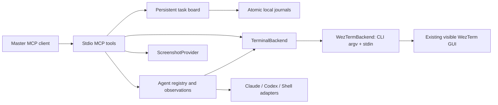

# Architecture and observation design decision

Status: accepted for the proof of concept.

## Why text first

We need stable pane identities, inexpensive incremental observations, and reliable input into interactive applications. WezTerm already exposes pane IDs and terminal text through its CLI. Pixels cost more context and are harder to diff, and visual inactivity does not establish completion. Therefore metadata and text are primary; screenshots are requested only when visual context helps resolve ambiguity. Consequence: state classifiers are intentionally heuristic and expose UNKNOWN rather than declaring silent tasks finished.

## Backend

`TerminalBackend` isolates the terminal implementation. `WezTermBackend` invokes the installed CLI with argument arrays and `--no-auto-start`, avoiding hidden GUI creation. The [WezTerm CLI reference](https://wezterm.org/cli/cli/index.html) defines the operations. IDs and commands are validated; no shell joins argv. Spawn commands belong to the selected terminal domain. The optional `scripts/launch-local` resolves local Claude/Codex executables from PATH and passes JSON argv overrides; npm Codex is launched with the same Node executable as the MCP host. Remote domains require explicitly supplied target-domain commands. Text goes through stdin with bracketed paste handling, while keys use `send-text --no-paste`. Submit separates paste and Enter by 100ms to allow TUI paste processing.

Windows WezTerm can be controlled from WSL using its `.exe`; it spawns Linux programs when the parent pane is in a WSL domain. The server environment must permit Windows interoperability. This was exercised against the installed 2024 CLI. Get-text uses negative starting lines for scrollback, then bounds the final tail. List preserves additional WezTerm JSON properties.

## Adapters and activity

`InteractiveAgentAdapter` has a client name and text classifier. ClaudeCodeAdapter and CodexAdapter recognize permission/question screens, errors, work indicators and prompt markers. ShellAdapter recognizes common shell prompt endings. These are patterns, not authenticated application state. An injected `command` must actually match the selected adapter.

Observation first checks pane existence and metadata, reads the recent tail, hashes it with SHA-256, updates output timestamps on change, and classifies text. Silence does not cause an IDLE transition. Permission/question patterns take precedence over prompt markers. After input, a short timing guard and comparison with the pre-input output hash prevent an unchanged old prompt from becoming ready merely because time passes. RUNNING_EXTERNAL_COMMAND and IDLE are reserved states; the current CLI/text evidence does not reliably distinguish them. Process information is passed through only when WezTerm supplies it.

Observations return IDs, status, activity, timestamps, output hash, cwd, process, input flags, and recent text. With `since`, identical output is omitted; prefix additions use append; screen rewrites use replace. Expired/unknown observation IDs return a full replacement with `deltaReset`. Each worker retains at most 16 observations of 24,000 characters; the registry is capped at 64. Agent observations are on demand; explicitly created watches also poll through the same guarded observation path. Missing panes remove registry entries; transport failures preserve them. Waits are bounded, return diagnostic last state, and never approve a prompt.

## Screenshots

`ScreenshotProvider` returns a PNG MCP image. `CommandScreenshotProvider` invokes a configured trusted executable with one pane ID argument; stdout must contain base64 PNG. It enforces a signature and 5 MiB bound. No polling captures screenshots.

The bundled PowerShell provider restricts candidates to the configured GUI socket PID when present, matches the current mux window title against that process window title, and captures the matching HWND with PrintWindow. A leading braille activity spinner is ignored. Ambiguous or changing titles produce an error instead of capturing an unrelated window. Captures include the whole terminal window, including other visible panes, activate the requested pane first, and restore a minimized window. The WSL wrapper uses a process-local execution policy override to run this repository's script; it does not change the machine policy. GPU capture may vary by driver, so inspect results on a new machine. Linux/macOS providers can implement the same executable contract.

## Lifecycle and failures

Managed Codex workers receive an explicit `$term-dad-worker` invocation and the
bundled skill body with their first submitted task. The same skill source ships
in `skills/` for local installation; embedding it avoids server-host paths in
remote domains. No prompt means initialization is deferred until `agent.send`
(also used by broadcasts). Successful submission marks initialization complete;
follow-ups remain literal. Concurrent inputs to one worker are rejected to avoid
interleaved pastes and duplicate initialization. Failed submission records uncertain delivery, since a transport failure after
paste/Enter may have delivered some input. Inspect and explicitly reattach before
retrying, declaring whether the skill was initialized. This is delivery of role
instructions, not proof the model followed them. Raw terminal operations do not
initialize skills, and Claude/shell inputs are unchanged.

MCP stdio stdout contains only protocol messages. Tool failures return `isError` and diagnostics; logs go to stderr without intentionally logging terminal content. CLI calls have a 15-second subprocess timeout and 8 MiB output limit. Worker waits allow up to 120 seconds plus the duration of the final observation. A failed initial prompt wait retains the worker for diagnosis. Closing the MCP connection does not kill workers. Multiple server instances sharing a state directory share durable worker metadata and input exclusion, while observation caches remain process-local.

## Durable event journal

`events.ts` exports `EventQueue`, `FileEventStorage`, the event input contract, and
an injectable `EventStorage` transaction boundary. `event-tools.ts` exports
`registerEventTools`. `createServer(backend?, screenshots?, watchOptions?, eventQueue?, workerStorage?, taskStorage?)`
returns both `watches` and `events`; passing an `EventQueue` as the third argument
remains supported. By default WatchManager publishes through the durable queue.
An explicitly injected `WatchOptions.sink` replaces that default for embedders.
Queue rejection leaves watch delivery pending and observable for later retry.
Event tool registration precedes watch registration so MCP disconnect disposes
watchers and awaits their in-flight sink before closing the queue and settling
event waits. No arbitrary event injection is exposed over MCP.

The queue persists only bounded metadata and queue-owned identity/acknowledgment
fields. Producers must construct summaries from static metadata, never excerpts
from terminal content, prompts, credentials, or exception messages. Journal
validation rejects unknown fields, malformed records, duplicate IDs, inconsistent
sequences and files over 4 MB. Corruption raises `EVENT_STATE_CORRUPT`; it never
resets the journal or silently discards pending records. Keep the damaged file
for explicit recovery from a verified copy; do not delete it to bypass an error.

Every file transaction takes an exclusive `events.lock` using atomic creation.
This serializes local processes sharing the state directory; short contention
retries are bounded. Each transaction rereads the journal, so other instances'
publications and acknowledgments are visible. Waits register before reading and
check pending events on local publication and every 100ms while waiting, avoiding
lost notifications and observing other instances. Filters combine with AND;
values within each filter combine with OR. Waiting does not reserve events.
Request cancellation, deadlines and queue close settle waits even during a pending
read. Queue close drains already accepted storage operations and rejects new work;
it never closes terminal panes. The in-memory operation backlog is capped at 128.

A mutation writes a unique 0600 temporary file, syncs it, atomically renames it to
`events.json`, then syncs the private containing directory. The rename is the
commit point. Failures before it reject publication and leave the old journal
intact. Directory sync or lock cleanup failure after commit is exposed through
`storageWarning` on subsequent lists, without rejecting an already committed
publication and provoking a duplicate producer retry. A directory-sync warning
means power-loss durability is uncertain. Warnings last for the storage instance's
lifetime. A process death immediately after commit may still leave the producer
unsure whether publication completed; this API does not promise exactly-once
production across that crash window.

A crash during a transaction can leave `events.lock` or an orphan `events.*.tmp`.
Locks are deliberately not stolen on a timer: a slow live writer must never lose
exclusivity. Stop **all** servers using that directory, preserve `events.json`,
then remove the stale lock and orphan temporary files before restarting. Pending
committed events then replay normally. Do not remove a lock while another server
may be using it. This implementation targets private local POSIX filesystems;
network filesystems and hostile same-user filesystem modification are outside its
locking/security model. Existing unsafe directory or journal permissions are
rejected. No background journal is created merely by starting the MCP server.

Only acknowledged events are evicted for space; full pending capacity rejects
publication explicitly. Acknowledgment is idempotent while a record is retained;
expired/unknown IDs are returned separately. Stable sequence counters survive
compaction, and overflow fails rather than wrapping. Waiters, list output, event
fields, journal size, operation backlog and timeouts all have fixed bounds.

## Background watches and desktop delivery

`WatchManager` in `src/watches.ts` owns up to 64 explicit watches. It takes injected
`TerminalBackend`, `Agents`, optional async event sink, notification provider, and
clock. A single unref'ed recursive timer drives serial non-overlapping passes;
`automatic:false` plus `poll()` supports deterministic schedulers. Backend calls
remain bounded by the transport. Injected sinks/providers must settle in bounded
time; they are awaited serially and must not call back into `poll()`/`dispose()`.

Managed watches call `Agents.observe`, preserving permission precedence and the
post-input stale-prompt guard. Unmanaged watches require an explicit adapter and
retain only a hash of the bounded 24,000-character text tail. Baseline suppresses
ready but surfaces input-required screens. Only successful listings establish
pane disappearance. Transitions deduplicate; inactivity resets on changed text.

Events contain only `{kind,paneId,watchId?,agentId?,occurredAt,summary}`, where
`occurredAt` is ISO and summaries are fixed strings. No titles, terminal output,
paths, secrets, raw backend errors, IDs for the queue, or acknowledgment metadata
are generated. The server supplies the queue as the default async sink; standalone
`WatchManager` instances still allow an optional sink and desktop delivery. Four pending
kinds per watch coalesce repeated undelivered transitions. Successful destinations
are tracked independently so one failed destination does not repeat another.

`registerWatchTools` isolates schemas and registration from `server.ts`, returns
an async disposer, and chains shutdown after awaiting disposal. The server chains
this with queue close; embedders can explicitly `await watches.dispose()` before
closing their queue. Disposal clears
timers and registrations immediately, waits for in-flight polls/creation, and
suppresses further delivery after an awaited operation returns. An external
notification or sink operation already in flight cannot be retracted. Nothing
closes worker panes on watch removal or MCP disconnect.

`CommandNotificationProvider` is opt-in through a JSON argv environment setting;
its bounded subprocess receives metadata JSON via stdin and never writes child
output to MCP stdout. See the tool reference for the Windows/WSL helper setup.

## Persistent worker registry

`worker-storage.ts` defines validated metadata and injectable `WorkerStorage`
transactions/exclusion. `FileWorkerStorage` and `FileEventStorage` share the
atomic `FileJournal` implementation in `journal.ts`, with separate files and
locks. `MemoryWorkerStorage` is explicitly available for tests/embedders; standalone
`Agents` defaults to isolated memory, while `createServer` defaults to file storage
and accepts storage as its fifth argument. Existing event-queue injection remains
compatible. Starting the server does not create a journal.

Durable records contain worker identity, adapter, endpoint/process identity, binding
revision, skill delivery flag, and input timestamp/hash/uncertainty. They contain no
terminal content, prompts, launch argv, cwd, or screenshots. Each managed operation
refreshes metadata before acting; observation caches are keyed by ID and binding
revision. The synchronous `Agents.get` exposes only that instance's existing cache.
Async resolution and managed operations are the source of truth.

Per-worker locks cover observation and input/lifecycle operations. Short journal
transactions enforce shared names, pane uniqueness, and capacity. Spawn reserves
a bounded record before launching without holding the journal lock across the
backend call. A failed mapping commit retains a diagnostic reservation and live
pane. Delivery intent is persisted before paste/Enter or Ctrl+C; only recorded
success clears uncertainty. No cross-crash exactly-once terminal delivery is
claimed. Concurrent operations reject as busy, and all admitted operations drain
on shutdown. Wait loops stop when their next observation sees shutdown.

`TerminalBackend.instance` is optional. The Windows/WSL resolver uses a configured
local GUI socket (or discovers the standard socket for a single GUI) and verifies
the executable, PID and start time via a read-only PowerShell helper. CLI and
screenshot subprocesses explicitly inherit the selected endpoint. A resolver
pins its first GUI identity and rejects a replacement until MCP restart. Other
backends return null unless an identity provider is injected. Null identity permits
only explicit process-local attachment; it never establishes automatic recovery.

Recovery verifies instance and pane existence. A different or unavailable instance
leaves records detached; missing panes are removed only after a matching-instance
check succeeds. Reattachment preserves logical identity but changes binding revision,
invalidating observation caches and requiring watch recreation. Managed screenshots
and watches use the same attachment checks. Watches remain process-local and
existing durable event records remain independent of worker removal.

See the tool reference for explicit adoption, uncertainty acknowledgment, stale-lock
recovery, and the single-GUI-per-server boundary.

## Persistent task board

`TaskBoard` separates task progress from terminal activity and worker lifecycle.
Strict task records contain goals, priorities, assignment UUIDs, dependency IDs,
blockers and acceptance criteria. Whole-graph validation rejects missing/cross-board
references, cycles and invalid completion. Every mutation after creation compares
an expected revision under the storage transaction, preventing lost updates across
supervisors. Worker disappearance never deletes tasks or infers completion.

`FileTaskStorage` shares `FileJournal` with workers/events but owns `tasks.json` and
`tasks.lock`. Startup is lazy. Corrupt state is preserved, writes are atomic, and
post-commit durability warnings do not turn successful writes into retryable
failures. Task state is bounded to 1,000 records and 4 MB; archived records still
count. Explicit descriptions and evidence are stored content, unlike the event
queue's static metadata; they must never be automatically populated from terminal
output. No task content is logged or used to execute commands.

`createServer` registers task tools with file storage by default, accepts injected
`TaskStorage` as its sixth argument and returns `tasks`. Task operations are capped
at 128 outstanding requests and drained during shutdown. Existing event/watch
shutdown ordering is retained. The standalone library requires explicit storage.

`task-workers.ts` enriches task reads with worker attachment snapshots and worker
views with up to 20 compact task summaries each. Summary failures are explicit and
do not prevent worker recovery. These are separate journal reads; assignments are
not atomic reservations, and missing workers remain referenced for later
reassignment. Worker observations cannot satisfy criteria or set task status.
Task-change event delivery and automatic dispatch are outside this implementation.
