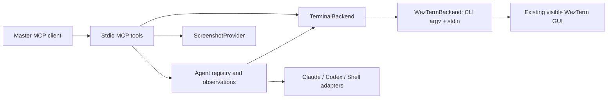

# Architecture and observation design decision

Status: accepted for the proof of concept.

## Why text first

We need stable pane identities, inexpensive incremental observations, and reliable input into interactive applications. WezTerm already exposes pane IDs and terminal text through its CLI. Pixels cost more context and are harder to diff, and visual inactivity does not establish completion. Therefore metadata and text are primary; screenshots are requested only when visual context helps resolve ambiguity. Consequence: state classifiers are intentionally heuristic and expose UNKNOWN rather than declaring silent tasks finished.

## Backend

`TerminalBackend` isolates the terminal implementation. `WezTermBackend` invokes the installed CLI with argument arrays and `--no-auto-start`, avoiding hidden GUI creation. The [WezTerm CLI reference](https://wezterm.org/cli/cli/index.html) defines the operations. IDs and commands are validated; no shell joins argv. Spawn commands belong to the selected terminal domain. The optional `scripts/launch-local` resolves local Claude/Codex executables from PATH and passes JSON argv overrides; npm Codex is launched with the same Node executable as the MCP host. Remote domains require explicitly supplied target-domain commands. Text goes through stdin with bracketed paste handling, while keys use `send-text --no-paste`. Submit separates paste and Enter by 100ms to allow TUI paste processing.

Windows WezTerm can be controlled from WSL using its `.exe`; it spawns Linux programs when the parent pane is in a WSL domain. The server environment must permit Windows interoperability. This was exercised against the installed 2024 CLI. Get-text uses negative starting lines for scrollback, then bounds the final tail. List preserves additional WezTerm JSON properties.

## Adapters and activity

`InteractiveAgentAdapter` has a client name and text classifier. ClaudeCodeAdapter and CodexAdapter recognize permission/question screens, errors, work indicators and prompt markers. ShellAdapter recognizes common shell prompt endings. These are patterns, not authenticated application state. An injected `command` must actually match the selected adapter.

Observation first checks pane existence and metadata, reads the recent tail, hashes it with SHA-256, updates output timestamps on change, and classifies text. Silence does not cause an IDLE transition. Permission/question patterns take precedence over prompt markers. After input, a short timing guard and comparison with the pre-input output hash prevent an unchanged old prompt from becoming ready merely because time passes. RUNNING_EXTERNAL_COMMAND and IDLE are reserved states; the current CLI/text evidence does not reliably distinguish them. Process information is passed through only when WezTerm supplies it.

Observations return IDs, status, activity, timestamps, output hash, cwd, process, input flags, and recent text. With `since`, identical output is omitted; prefix additions use append; screen rewrites use replace. Expired/unknown observation IDs return a full replacement with `deltaReset`. Each worker retains at most 16 observations of 24,000 characters; the registry is capped at 64. Polling is on demand, not a background loop. Missing panes remove registry entries; transport failures preserve them. Waits are bounded, return diagnostic last state, and never approve a prompt.

## Screenshots

`ScreenshotProvider` returns a PNG MCP image. `CommandScreenshotProvider` invokes a configured trusted executable with one pane ID argument; stdout must contain base64 PNG. It enforces a signature and 5 MiB bound. No polling captures screenshots.

The bundled PowerShell provider matches the current mux window title against WezTerm GUI process window titles and captures the matching HWND with PrintWindow. A leading braille activity spinner is ignored. Ambiguous or changing titles produce an error instead of capturing an unrelated window. Captures include the whole terminal window, including other visible panes, activate the requested pane first, and restore a minimized window. The WSL wrapper uses a process-local execution policy override to run this repository's script; it does not change the machine policy. GPU capture may vary by driver, so inspect results on a new machine. Linux/macOS providers can implement the same executable contract.

## Lifecycle and failures

MCP stdio stdout contains only protocol messages. Tool failures return `isError` and diagnostics; logs go to stderr without intentionally logging terminal content. CLI calls have a 15-second subprocess timeout and 8 MiB output limit. Worker waits allow up to 120 seconds plus the duration of the final observation. A failed initial prompt wait retains the worker for diagnosis. Closing the MCP connection does not kill workers. Multiple server instances have independent registries but see the same terminal panes.
