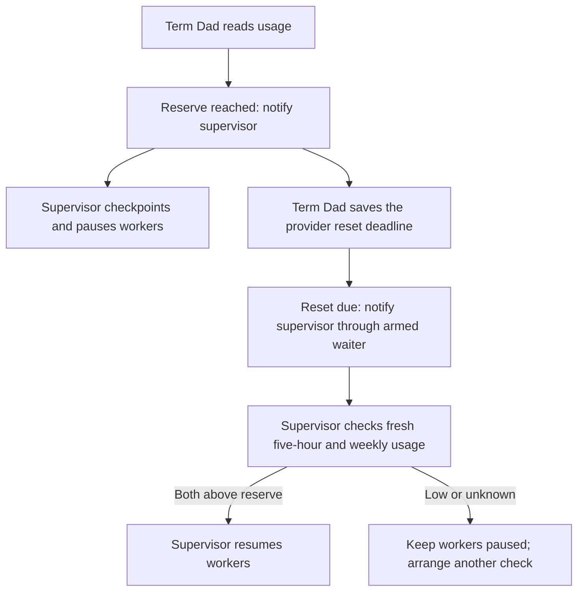

# Account usage monitoring

Term Dad separates provider account allowance from session token counts and MCP
telemetry. Several workers may share one quota; their percentages are never added.

## Support and limits

| Source/client | Collection | Supervisor notifications |
| --- | --- | --- |
| Codex | Read-only app-server account/rateLimits/read; no model turn | Repository-owned lifecycle hooks |
| Claude Code | Passive statusLine rate_limits fields, when present | Repository-owned lifecycle hooks |
| Copilot CLI | Unavailable; session tokens are not subscription quota | Hooks can describe configured account status |

Term Dad measures usage and delivers notices. The supervising assistant decides
when to checkpoint, pause, and resume workers through its normal tools. There is
no automatic-control mode, dispatch gate, or pause/resume state machine.

Installed hooks deliver context at supported client boundaries. At idle, keep the
`event.wake_command` background waiter armed: its defaults include threshold,
reset-due, and observed-reset events. Process completion wakes the assistant only
where the client supports that behavior; writing an event or showing a desktop
alert does not itself wake a model. Claude's passive feed cannot provide a fresh
reading while the client is paused unless it receives new quota data.

Sources: [Codex account API](https://learn.chatgpt.com/docs/app-server#6-rate-limits-chatgpt),
[Codex hooks](https://learn.chatgpt.com/docs/hooks),
[Claude status lines](https://code.claude.com/docs/en/statusline),
[Claude hooks](https://code.claude.com/docs/en/hooks),
[Copilot hooks](https://docs.github.com/en/copilot/reference/hooks-reference).

## Configuration and tools

```js
usage.configure({
  accountRef: "personal",
  provider: "codex",
  reservePercent: 5,
  weeklyReservePercent: 5,
  workerIds: []
})
usage.refresh({ accountRef: "personal" })
usage.watch({ accountRef: "personal", thresholdsUsedPercent: [80, 90, 95], notifyOnReset: true })
usage.status({ accountRef: "personal" })
event.list({ accountRefs: ["personal"], kinds: ["usage.threshold"] })
```

`usage.configure` replaces that account's configuration; include existing worker
IDs when updating it. Worker IDs must be real registered UUIDs. One worker cannot
belong to two configured accounts. Account names are local opaque identifiers,
not login credentials. Hooks bind the supervising session explicitly through
`--account`; `agent.spawn` accepts an explicit `accountRef` for a new worker.
That binding lives on the worker record and ends with its removal, without growing
`usage.configure.workerIds`. The latter explicitly binds already-existing workers;
conflicting launch bindings are rejected.
No account identity is inferred from the model/client name.

Codex accepts an absolute `codexHome` and optional CLI `profile`. These select the
CLI's configuration; no tokens are copied into Term Dad. The collector invokes
`codex app-server`, initializes it, reads auth metadata and quotas, then closes it.
It never starts a thread, logs in, purchases credits, or sends an inference request.
`TERM_DAD_CODEX_EXECUTABLE` may select an installed executable. An email fingerprint
detects some login changes but does not prove workspace identity; the email itself
is not persisted.

Claude collection requires installing its status-line wrapper. Absent weekly or
short-window fields remain unknown. Repainting the same quota data with the same
API-duration counter does not refresh its observation time. Existing status-line
rendering remains intact. Model-specific windows not exposed by the documented
feed cannot be inferred from token counts.

`usage.unwatch` removes threshold/reset alerts, but keeps collection and
observations. Set `enabled: false` through `usage.configure` to disable the account.
Account removal and private provider endpoints are not exposed.

## Usage workflow



Before pausing, arm the event waiter and keep the MCP process running. The default
reserve is 5% in both windows. Request checkpoints and preserve panes and task
state; `agent.stop` closes a pane and is not a pause. Before resuming, inspect
pending results, assignments, permission screens, and uncertain input. Never
replay a command merely because the quota reset.

When a known five-hour or weekly window reaches its reserve, its reset timestamp
arms a durable local alert. `usage.reset_due` fires at the expected deadline,
independently of provider reads and their retry backoff. It asks the supervisor to
verify both allowances; it never starts workers or asserts recovery. Keep the
supervisor waiter armed before parking work, and leave the MCP process running.
Overdue alerts are delivered on restart. `usage.status.resetAlerts` shows each
scheduled deadline and whether its alert has been enqueued. Missing reset times
cannot arm an alert. Disabling the account, unwatching, or setting
`notifyOnReset: false` cancels future alerts. New observations replace obsolete
deadlines. Existing journals acquire deadlines with their next observation.

The supervisor should require every applicable five-hour and weekly window to
have **more than** its reserve left. Status reports readings older than two
minutes, expired reset timestamps, missing windows, and failed reads as concerns.
These readings cannot establish recovery. Provider polling runs at most once a
minute with exponential failure backoff capped at fifteen minutes; reset alerts
run independently. Unknown quotas may require a manual check or a later event.
Hook output is delivery evidence, not proof the assistant followed the request.

The 5% threshold cannot guarantee a hard spending ceiling: provider reporting
lags and in-flight work may overshoot. There is no automatic provider switching.

## Persistence and events

The owner-only `usage.json` journal is bounded to 32 accounts, 64 sessions per
account, 32 quota windows per observation, and 64 pending events per account.
Metadata uses the existing atomic journal contract. Collectors use a separate
per-account lock, so a network call never holds the usage journal lock. Dead
collector owners are recoverable through the existing PID-based lock protocol.

Events are `usage.threshold`, `usage.reset_due`, and `usage.reset`. They carry an
`accountRef` instead of a fabricated pane.
Pending publications retry with a delivery key; retained events deduplicate
cross-process retries. Once a record is acknowledged and evicted, the queue
cannot guarantee deduplication across an old interrupted producer retry.
Configured desktop notification commands receive the same bounded metadata;
delivery can repeat after a crash between notification and outbox cleanup.
Event publication and desktop delivery have separate retry stages. Desktop work
is bounded to eight concurrent notifications and cannot hold up quota collection
or reset-event publication. `usage.status.notificationError` reports desktop
failures. If the 64-entry account outbox fills, only the oldest already-published
desktop retry may be evicted; `usage.status.accounts[].notificationDropped` exposes
the count. Unpublished monitoring events are never discarded. Successfully published events
are not republished just to retry desktop delivery. Notification context revisions are separate from source-configuration
revisions, so a reset alert does not invalidate an in-flight quota read.
When one observation crosses several thresholds for a window, one event reports
the highest crossed threshold and the number crossed; every threshold is still
tracked individually for deduplication and hysteresis.

Monitoring ends when the hosting MCP process closes. Reopening reloads durable
state and resumes monitoring. No background OS service is installed. Event journal writes now use version 2: upgrade all Term Dad clients
sharing the state directory together. Existing version-1 IDs, sequences, and
acknowledgments are retained. An old binary cannot read version 2; do not downgrade
without restoring a compatible backup while all writers are stopped.

## Upgrading from the earlier control model

Usage journal version 2 reads and migrates version-1 accounts, observations,
reset deadlines, and pending monitoring notifications. It removes control state
and pending pause/resume notices. Already published events remain in the
event journal for inspection and acknowledgment; they are not worker instructions.
The next usage mutation saves version 2. Restart all clients sharing the state
directory together; older binaries cannot read the new usage journal.

Remove `mode` from `usage.configure` calls. Status no longer returns `mode`,
`phase`, parked-session state, or pause/wake capabilities; `collection` reports
`active`, `passive`, or `unavailable`. `reason` describes quota concerns, not a
worker's execution state. Rerun `hooks install` to remove installer-owned Stop
hooks while preserving unrelated hooks. Custom `usage-hook --wait` invocations
must be replaced with `event.wake_command`.

## Verification

Run `npm run check`. `npm run test:usage -- codex` is an opt-in live account read;
it prints quota metadata without account identity and does not request inference.
See [testing evidence](testing.md) for results actually obtained. Installation
and hook transport can be exercised with temporary configuration and synthetic
quota data; those tests do not establish real client pause/wake support.
